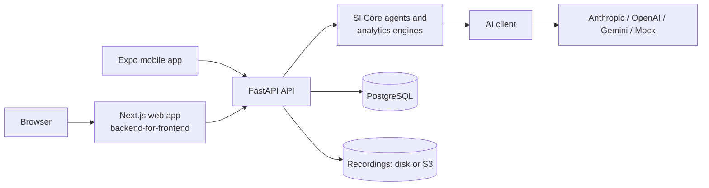

# LinguaSI

**Learn English. Master IELTS. Let Intelligence Adapt to You.**

LinguaSI is an English and IELTS-preparation platform with a web app, a mobile app and one shared
API. An AI layer called SI Core watches how each learner actually performs, across writing,
speaking, reading, listening, vocabulary and grammar, and adapts what they practise next, explaining
every recommendation it makes.

> LinguaSI gives **AI Estimated** bands and levels for practice. They are not official IELTS results,
> and LinguaSI is not affiliated with or endorsed by IELTS, the British Council, IDP or Cambridge
> University Press & Assessment. All learning content is original.

## Contents

1. [Overview](#1-overview)
2. [Features](#2-features)
3. [Architecture](#3-architecture)
4. [Tech stack](#4-tech-stack)
5. [Folder structure](#5-folder-structure)
6. [Database architecture](#6-database-architecture)
7. [AI architecture](#7-ai-architecture)
8. [Environment variables](#8-environment-variables)
9. [Installation](#9-installation)
10. [Database migrations](#10-database-migrations)
11. [Seed and demo data](#11-seed-and-demo-data)
12. [Running the web app](#12-running-the-web-app)
13. [Running the mobile app](#13-running-the-mobile-app)
14. [Running the backend](#14-running-the-backend)
15. [Testing](#15-testing)
16. [AI provider configuration](#16-ai-provider-configuration)
17. [Mock AI Mode](#17-mock-ai-mode)
18. [Deployment](#18-deployment)
19. [Future improvements](#19-future-improvements)

## 1. Overview

A learner signs up, describes their goal (IELTS Academic, General Training or general English),
target band and routine, and takes a 15-minute diagnostic. From then on, every activity feeds one
learner profile:

- an essay's grammar mistakes appear in **My Mistakes**, become a targeted practice set, and lower
  the priority of skills the learner already handles well;
- collocation errors in writing add collocations to the vocabulary queue, which then show up as
  speaking targets;
- the dashboard's recommendation says what to do next and **why**, citing the learner's own data.

Everything works without an AI provider in **Mock AI Mode**, and real feedback from Anthropic
Claude, OpenAI or Google Gemini can be switched on with server-side environment variables.

## 2. Features

| Area | What learners get |
| --- | --- |
| Onboarding | Goal, module, target band, test date, level, confidence, routine and topics; 15-minute diagnostic (vocabulary, grammar, reading, listening, writing, speaking) with an AI estimated band and CEFR level |
| Dashboard | Estimated band and level, streak, XP and level, weekly minutes against the goal, SI recommendation with "Why this?", daily mission, learning insight, skills overview, focus areas, "What SI changed" |
| Writing | IELTS-style Task 1 (charts, tables, processes) and Task 2, General Training letters and general English tasks; original task generator; tutor mode with hints that never write the essay, exam mode with a timer; criterion-by-criterion evaluation, errors highlighted in the text, comparison with earlier attempts |
| Speaking | Parts 1, 2 and 3 or a full mock test with an examiner voice, Part 2 preparation timer, follow-up questions, recording with pause detection; evaluation at the end from transcripts and measured fluency, with pronunciation assessed only when the audio allows it |
| Reading and listening | Practice sets in IELTS question types, adaptive difficulty, answers linked to evidence in the text or transcript, device or server voices with a different voice per speaker |
| Vocabulary | Spaced repetition with exercises that change as a word is learned, a word bank, words added from the learner's own writing and speaking, credit for using words in context |
| My Mistakes | Every mistake from every module in one place: charts, a category-by-week heatmap, recurring patterns, guides, mini practice, mastery tracking, revisit later |
| Practice and English Lab | Targeted practice sets mixing the learner's own sentences with focused exercises; daily phrase, grammar drills, sentence building, pronunciation clarity check, role-play conversations |
| SI Tutor | Chat that teaches with hints and questions before giving answers |
| Progress | Question-titled charts (band history, skills, weekly scores, vocabulary growth, mistake reduction, consistency), each with a table view |
| Motivation | XP and levels, streaks with freezes, achievements, daily missions, weekly challenges |
| Account | Light, dark or system theme synced across devices, recordings on or off, password change (signs out other devices), account deletion |
| Admin | Users (search, details, roles, activation), content browser and editor, AI usage and failures, system logs |

## 3. Architecture



- **One API for every client.** The web app and the mobile app call the same REST API, so a learner
  can start on one device and continue on the other.
- **The browser never holds tokens or keys.** The web app's server keeps the session in `httpOnly`
  cookies and forwards requests to the API. The mobile app keeps a rotating refresh token in the
  phone's secure storage. AI keys exist only in the API's environment.
- **SI Core** turns every completed activity into updates across skills, mistakes, vocabulary,
  recommendations and rewards in one transaction.

Details: [docs/architecture.md](docs/architecture.md).

## 4. Tech stack

| Layer | Technology |
| --- | --- |
| API | Python 3.12, FastAPI, Pydantic 2 and pydantic-settings, SQLAlchemy 2, Alembic, psycopg 3, Argon2 password hashing, PyJWT, Uvicorn |
| Database | PostgreSQL 16 |
| AI | Provider abstraction over the official `anthropic` SDK, OpenAI and Gemini HTTP APIs, and a deterministic mock; Pydantic schemas for structured output |
| Web | Next.js 16 (App Router, Cache Components), React 19, TypeScript, Tailwind CSS 4, TanStack Query 5, Recharts, next-themes, lucide icons |
| Mobile | Expo SDK 57, React Native 0.86, TypeScript, Expo Router, TanStack Query 5, expo-audio, expo-speech, expo-secure-store, react-native-svg |
| Testing | pytest (API), Vitest and Testing Library (web), Jest and React Native Testing Library (mobile), Playwright (end to end), Ruff and ESLint |
| Delivery | Docker images for the API and web app, Docker Compose, GitHub Actions, EAS Build for the mobile app |

## 5. Folder structure

```
backend/                FastAPI application
  app/
    api/                routes and request dependencies (auth, admin, rate limits)
    agents/             SI Core and its agents (examiners, tutor, planner, analysts, generators)
    ai/                 AI client, providers, prompts, response schemas, mock, speech
    analytics/          deterministic engines (grammar rules, essay and speech metrics, SRS, scoring)
    core/               settings, database, security, errors, logging, rate limiting
    models/             SQLAlchemy models
    schemas/            API request and response models
    services/           domain logic per module
    seed/               seed loader and demo-learner generator
    cli.py              management commands
  tests/                unit, API and integration tests
  Dockerfile
database/
  migrations/           Alembic migrations
  seed/                 curated, original learning content (JSON)
  demo/                 demo-learner profile used by the demo generator
web/                    Next.js web app (see web/README.md)
mobile/                 Expo mobile app (see mobile/README.md)
docs/                   architecture, AI system and deployment guides
docker-compose.yml      PostgreSQL + API + web on one machine
.github/workflows/      CI: backend, web, mobile, end-to-end
```

## 6. Database architecture

PostgreSQL holds everything a learner does, so progress survives devices, sessions and reinstalls.
The schema is managed with Alembic and grouped by domain:

- **Accounts:** users, learner profiles (goal, target band, routine, theme, preferences) and
  sign-in sessions (hashed, rotating refresh tokens).
- **Learner intelligence:** per-skill scores and difficulty levels, daily progress snapshots,
  study sessions, the diagnostic attempt, recommendations with the signals behind them, and the
  "What SI changed" event feed.
- **Learning content:** writing tasks, reading passages and questions, listening scripts and
  questions, speaking topics, vocabulary items, grammar exercises and achievements. Curated content
  is shared; generated content belongs to the learner it was made for.
- **Activities:** writing submissions and evaluations, speaking sessions with transcripts and
  evaluations, reading and listening attempts, practice sets, vocabulary reviews, tutor
  conversations.
- **Mistakes:** one tracker for errors from every module, deduplicated, with occurrences, status
  (unresolved, improving, mastered) and practice history.
- **Motivation:** XP events, streak data, achievements, daily missions and weekly challenges.
- **Operations:** AI interaction logs (metadata only by default) and system logs for the admin
  panel.

The full table list and relationships are in [docs/architecture.md](docs/architecture.md#data-model).

## 7. AI architecture

Agents with narrow jobs (writing examiner, speaking examiner, error analyst, vocabulary engine,
practice generator, tutor, learning planner, progress analyst) share a compact learner context and
talk to models through one AI client. The client renders centralised prompt templates, picks a fast
or strong model by task, requires structured output that validates against a schema, makes one
repair attempt when it doesn't, and logs every call. Agents then check the output against its
sources: a quoted error must exist in the learner's text, a reading answer must be backed by an
exact quote. When the AI is unavailable, nothing the learner did is lost and the app falls back
gracefully.

Details: [docs/ai-system.md](docs/ai-system.md).

## 8. Environment variables

Each part has a commented template; copy it and adjust.

| File | For | Key settings |
| --- | --- | --- |
| [`backend/.env.example`](backend/.env.example) | API (every setting) | `DATABASE_URL`, `JWT_SECRET`, `AI_PROVIDER`, `AI_MOCK_MODE`, `ANTHROPIC_API_KEY` / `OPENAI_API_KEY` / `GEMINI_API_KEY`, `AI_MODEL_FAST`, `AI_MODEL_STRONG`, `STT_PROVIDER`, `TTS_PROVIDER`, `STORAGE_BACKEND`, `CORS_ORIGINS`, `ADMIN_EMAILS`, `PROXY_SHARED_SECRET` |
| [`web/.env.example`](web/.env.example) | Web app server | `BACKEND_URL`, `COOKIE_SECURE`, `PROXY_SHARED_SECRET` |
| [`mobile/.env.example`](mobile/.env.example) | Mobile app | `EXPO_PUBLIC_API_URL` (public by design) |
| [`.env.example`](.env.example) | Docker Compose | `JWT_SECRET`, `POSTGRES_PASSWORD`, AI and speech settings, `COOKIE_SECURE` |

The API reads real environment variables first, then `backend/.env`, then the repository's root
`.env`. An empty value (`KEY=`) means "use the default". AI keys belong only in the API's
environment, never in the web or mobile app.

## 9. Installation

**Quickest: Docker Compose** (Docker with Compose v2.24 or later)

```sh
cp .env.example .env              # then set JWT_SECRET to the output of: openssl rand -hex 32
docker compose up --build
docker compose exec api python -m app.cli demo    # optional demo learner
```

Open http://localhost:3000. The API and its interactive documentation are at http://localhost:8000/docs.

**Local development** needs Python 3.12+, Node.js 22 and PostgreSQL 16.

```sh
# Database
createuser --createdb -P linguasi      # password: linguasi (or change DATABASE_URL); the tests create linguasi_test
createdb -O linguasi linguasi

# API
cd backend
python -m venv .venv && source .venv/bin/activate
pip install -r requirements-dev.txt
cp .env.example .env                   # optional; defaults work for local development
alembic upgrade head

# Web app
cd ../web && npm install

# Mobile app
cd ../mobile && npm install
```

## 10. Database migrations

Migrations live in `database/migrations` and run from `backend/`:

```sh
alembic upgrade head                              # apply all migrations
alembic revision --autogenerate -m "add feature"  # after changing models in app/models
alembic downgrade -1                              # roll back the last migration
```

The Docker image applies migrations on every start. A test (`tests/integration`) fails if the models
and the migrations ever drift apart.

## 11. Seed and demo data

The curated content in `database/seed` is loaded automatically the first time the API starts with an
empty content library (`AUTO_SEED=true`): 194 vocabulary items, 145 grammar exercises, 26 writing
tasks, 12 reading passages, 8 listening scripts, speaking topics (12 Part 1 topics, 10 cue cards),
24 achievements, plus the diagnostic, English Lab content (daily phrases, pronunciation sets,
conversation scenarios) and the grammar knowledge base. All of it was written for LinguaSI.

Management commands (run from `backend/`):

```sh
python -m app.cli seed                                   # load or refresh the curated content
python -m app.cli demo [--days 28] [--reset]             # demo learner with weeks of realistic history
python -m app.cli create-admin --email you@example.com   # create an admin, or promote an existing user
python -m app.cli status                                 # configuration, AI mode and database status
```

The demo learner signs in with **demo@linguasi.app** / **LinguaSI-demo-2026** and has writing and
speaking evaluations, mistakes, vocabulary history, streaks and achievements to explore.

## 12. Running the web app

```sh
cd web
npm run dev        # http://localhost:3000 (expects the API on http://localhost:8000)
```

`BACKEND_URL` points the web server at another API address. Production: `npm run build && npm start`
or the `web/Dockerfile` image. More in [web/README.md](web/README.md).

## 13. Running the mobile app

```sh
cd mobile
npx expo start            # press a (Android), i (iOS) or scan the QR code
npx expo start --go       # use Expo Go instead of a development build
```

The app finds the API on port 8000 of the machine running Metro; set `EXPO_PUBLIC_API_URL` to use
another address (start the API with `--host 0.0.0.0` for a phone on the same Wi-Fi). Development
builds, EAS profiles and speech details are in [mobile/README.md](mobile/README.md).

## 14. Running the backend

```sh
cd backend
source .venv/bin/activate
uvicorn app.main:app --reload --port 8000
```

- Interactive API documentation: http://localhost:8000/docs (OpenAPI at `/openapi.json`)
- Health: `/health` (process) and `/health/ready` (database)
- Runtime mode: `/meta` (AI provider, mock mode, speech providers)

Errors always have the shape `{"error": {"code", "message", "details?", "request_id"}}`.

## 15. Testing

| Suite | Command | What it covers |
| --- | --- | --- |
| API | `cd backend && pytest` | 155 tests: unit (grammar rules, essay and speech metrics, scoring, SRS, difficulty, security, settings, AI client), API (every module, authorization, sessions, validation, AI outages, rate limits), integration (full learner journey, streaks across days, cross-skill effects, concurrent first-use rows, demo generator, migration drift). Needs PostgreSQL: the suite creates `linguasi_test` on localhost (or uses `TEST_DATABASE_URL`) and wipes it on every run, so never point it at real data. |
| API lint | `cd backend && ruff check app tests && ruff format --check app tests` | Style and common bugs |
| Web | `cd web && npm run lint && npm run typecheck && npm test` | 44 Vitest tests: API client and session handling, server-side session refresh and forwarded headers, formatting, essay highlighting, practice runner, toasts, question forms, charts |
| Mobile | `cd mobile && npm run typecheck && npm run lint && npm test` | 20 Jest tests: API client and token refresh, validation, routes, pause detection, practice runner, recorder |
| End to end | `cd web && npm run e2e` | The acceptance journey in Chromium: register, profile, diagnostic, recommendation, essay evaluation, mistakes, targeted practice, vocabulary, speaking, reading, listening, XP and streak, progress, dark theme, then signing in again from a fresh browser |

All suites run in Mock AI Mode, so they need no AI keys. GitHub Actions runs them on every push
(`.github/workflows`): backend, web (lint, types, tests, production build), mobile (types, lint,
tests, Android and iOS bundle export) and the end-to-end journey against the production web build.

## 16. AI provider configuration

Set these in the API's environment (`backend/.env` or your host's settings), then restart the API:

```sh
# Anthropic Claude
AI_MOCK_MODE=false
AI_PROVIDER=anthropic
ANTHROPIC_API_KEY=sk-ant-...
# AI_MODEL_FAST=claude-haiku-5-5      # defaults
# AI_MODEL_STRONG=claude-opus-5-5

# or OpenAI
AI_MOCK_MODE=false
AI_PROVIDER=openai
OPENAI_API_KEY=sk-...                  # defaults: gpt-5-mini / gpt-5

# or Google Gemini
AI_MOCK_MODE=false
AI_PROVIDER=gemini
GEMINI_API_KEY=...                     # defaults: gemini-2.5-flash / gemini-2.5-pro
```

Server speech recognition and voices use OpenAI (`STT_PROVIDER=openai`, `TTS_PROVIDER=openai`,
needs `OPENAI_API_KEY`), independently of the text provider. Other useful settings:
`AI_EFFORT_FAST` / `AI_EFFORT_STRONG`, `AI_TIMEOUT_SECONDS`, `AI_USER_HOURLY_LIMIT` (cost control per
learner), `AI_LOG_CONTENT` (off: prompts and answers are not stored).

API usage is billed by the provider to the key's account. A chat or Claude Code subscription does
not include API credits. Check `GET /meta` or `python -m app.cli status` to confirm which provider is
active.

## 17. Mock AI Mode

Mock AI Mode is the default and is used whenever `AI_MOCK_MODE=true`, `AI_PROVIDER=mock`, or the
chosen provider has no key. Instead of calling a model, each AI task is answered by LinguaSI's own
engines: rule-based grammar detection and essay metrics drive writing feedback, measured speech
features drive speaking feedback, and curated content stands in for generated passages. Results are
deterministic and labelled "Mock AI Mode analysis" in the apps; everything else (mistake tracking,
recommendations, XP, progress) works exactly as with a real provider. It is how the tests, the demo
and a no-cost deployment run.

## 18. Deployment

The short version: a managed PostgreSQL database, the API container (Railway, Render or any container
host), the web app on Vercel (or its container), and EAS Build for the mobile app. A single server can
run everything with Docker Compose.

The full guide, with platform steps, production settings, client-address handling for rate limits
and a checklist, is in [docs/deployment.md](docs/deployment.md).

## 19. Future improvements

- **On-device speech recognition in the mobile app** through a development-build module, so spoken
  answers are transcribed without a server speech provider (today they are typed or dictated).
- **Phoneme-level pronunciation feedback** from a dedicated pronunciation-assessment service, shown
  with its confidence.
- **Shared API types** generated from the OpenAPI schema for the web and mobile apps (types are
  currently kept in sync by hand).
- **Background jobs and streaming** for long AI work (content generation, evaluations) and streamed
  tutor replies.
- **Push notifications** for streak reminders and due vocabulary reviews.
- **Offline vocabulary reviews** on mobile, synced when back online.
- **Teacher and classroom accounts** to review learners' work and assign tasks.
- **Explanations in the learner's first language** for beginners.
