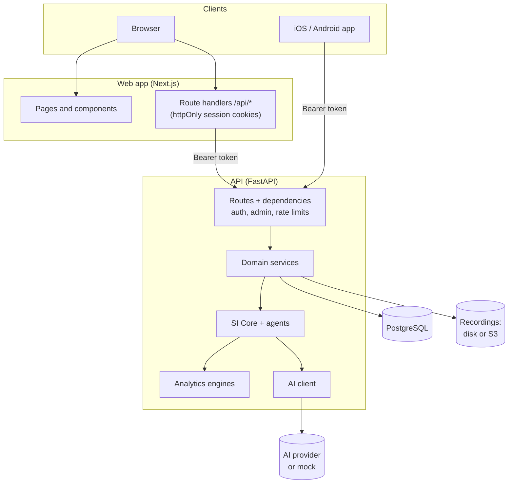
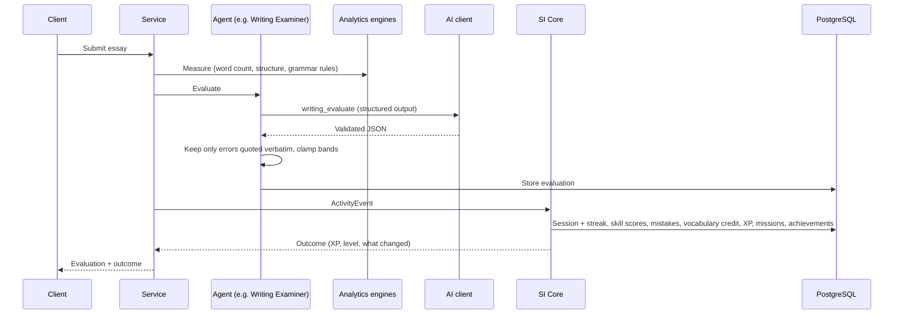
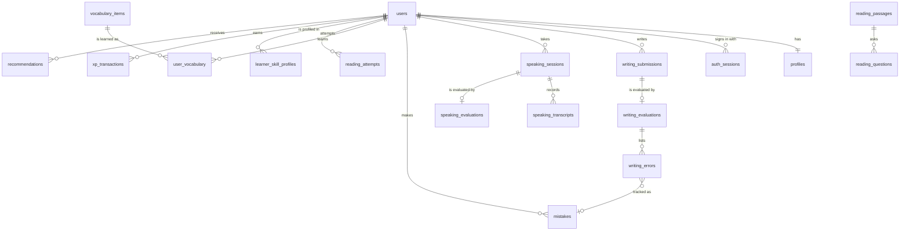
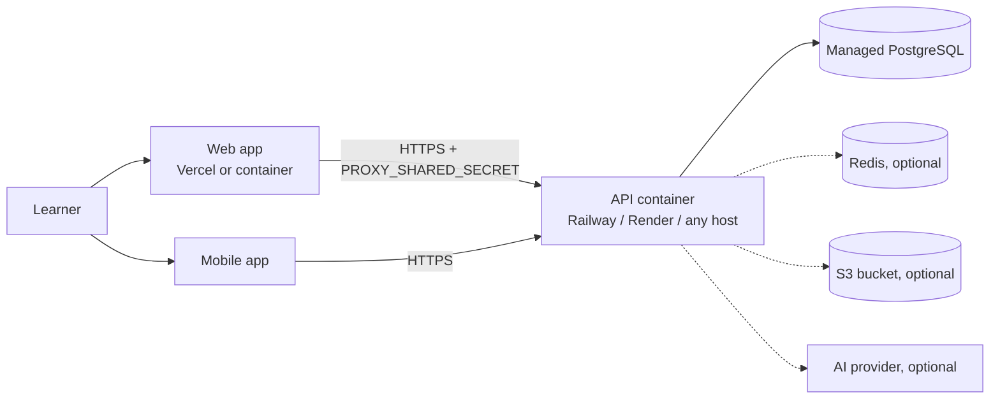

# Architecture

LinguaSI is three applications around one database:

- **API** (`backend/`): FastAPI. Owns all data, all business rules, every AI call and every
  authorization decision.
- **Web app** (`web/`): Next.js. Server-renders the interface and proxies the browser's requests to
  the API (backend-for-frontend), so tokens never reach page JavaScript.
- **Mobile app** (`mobile/`): Expo / React Native. Calls the API directly with bearer tokens.

## API layers

| Layer | Folder | Responsibility |
| --- | --- | --- |
| Routes | `app/api/routes` | HTTP: validation with Pydantic schemas (`app/schemas`), dependencies for the current user, admin role and rate limits, response models |
| Services | `app/services` | One module per domain (writing, speaking, reading, listening, vocabulary, practice, mistakes via the error analyst, dashboard, diagnostic, tutor, lab, gamification, admin, auth, users, storage) |
| Agents | `app/agents` | SI Core orchestration and the agents that evaluate, generate, plan and analyse (see [ai-system.md](ai-system.md)) |
| Analytics | `app/analytics` | Deterministic engines: rule-based grammar detection, essay and speech metrics, band and level scoring, spaced repetition, adaptive difficulty, streaks |
| AI | `app/ai` | AI client, providers, prompt templates, response schemas, mock handlers, speech providers |
| Data | `app/models`, `database/migrations` | SQLAlchemy models and Alembic migrations |
| Core | `app/core` | Settings, database sessions, security (hashing, tokens), error handling, request logging, rate limiting |

Every request gets a request ID (`X-Request-ID`), and every error uses one shape:
`{"error": {"code", "message", "details?", "request_id"}}`, so the clients can show a friendly message
and support can find the log line. Access logs contain method, path, status and latency only, never
request bodies (essays, transcripts and audio stay out of logs).

### Completing an activity

Every learning activity ends the same way, which is what makes the product feel like one system:

## Authentication and sessions

- Passwords are hashed with Argon2. Sign-in is rate limited per address and per account, and
  registration per address.
- Signing in returns a short-lived **access token** (JWT, HS256, 30 minutes; claims: user, role,
  session ID) and a long-lived **refresh token** (random, 30 days) that is stored only as a SHA-256
  hash in `auth_sessions`.
- Refreshing **rotates** the refresh token. Requests that arrive together with the same token (a page
  making several calls just after its access token expired) all get working tokens if they come
  within 30 seconds of the rotation. Presenting a rotated token later is treated as theft and ends
  every session of the account; a token that was simply signed out is refused without side effects.
- An access token stops working as soon as its session ends: signing out, changing the password on
  another device (the device that changed it stays signed in) and theft detection all take effect on
  the next request. Deactivated accounts are refused on every request.
- Admin routes require the admin role, checked on the server for every call.

### Web app (backend-for-frontend)

The browser talks only to the Next.js server:

1. `/api/auth/login` and `/api/auth/register` call the API and store both tokens in `httpOnly`,
   `SameSite=Lax` cookies (`Secure` in production).
2. `/api/backend/<path>` forwards any other request with the access token. When the token has
   expired it refreshes once, retries, and stores the new tokens; requests that arrive together share
   one refresh. If refreshing fails it clears the cookies, and the client sends the learner to sign in
   (returning to the same page afterwards).
3. `/api/auth/logout` revokes the refresh token on the API and clears the cookies.
4. `src/proxy.ts` redirects signed-out visitors away from app pages before they render; the API still
   authorizes every request.

The web server forwards each learner's address so the API's per-address limits count learners
separately (see [deployment.md](deployment.md#4-client-addresses-and-rate-limits)).

### Mobile app

The access token is kept in memory and the refresh token in the iOS Keychain / Android Keystore
(`expo-secure-store`). An expired access token is refreshed once, transparently; refreshes are
single-flight because the API rotates refresh tokens and would treat a parallel reuse as theft. The
app's routes are protected with Expo Router's `Stack.Protected`.

## Clients

Both clients use TanStack Query for server state, mirror each other's routes (`/writing`,
`/practice/new?focus=...`), and render the API's recommendation, mission and Lab links as they are.

| | Web | Mobile |
| --- | --- | --- |
| Framework | Next.js 16 App Router with Cache Components | Expo SDK 57, Expo Router, React Compiler |
| Navigation | Sidebar with grouped sections and a mobile drawer | Bottom tabs: Home, Practice, Vocabulary, Tutor, Me |
| Styling | Tailwind CSS 4 design tokens, light and dark | Theme tokens mirroring the web palette, light and dark |
| Charts | Recharts | react-native-svg charts with tap-to-inspect |
| Speech | Web Speech API (live transcript, voices), MediaRecorder with level metering | `expo-audio` recording with metering, `expo-speech` voices |
| Tokens | `httpOnly` cookies on the Next.js server | Secure storage + memory |

The theme (light, dark or system) is saved in the learner's profile and adopted by every device the
learner signs in on.

## Speech and recordings

Recordings are uploaded with the answer (size limited by `MAX_AUDIO_UPLOAD_MB`) and stored through
`services/storage.py` on local disk or in an S3-compatible bucket, only when the learner keeps
recordings switched on. They are served back only to their owner. Transcripts come from the server
(`STT_PROVIDER=openai`), the browser's speech recognition, or the learner typing; the source is stored
with each answer.

## Privacy

- Essays, transcripts and audio never appear in logs. AI logs store metadata only (task, model,
  latency, tokens, outcome) unless `AI_LOG_CONTENT=true` is set for debugging.
- Recordings are kept only while the learner has recordings switched on, and are served only to
  their owner.
- Deleting an account requires the password and removes the learner's data, recordings, any content
  generated for them and any stored AI prompt previews.
- Admin views show metadata only; there is no admin endpoint for reading a learner's essays or
  transcripts.

## Data model

40 tables in PostgreSQL 16, defined in `backend/app/models` and created by the Alembic migration in
`database/migrations` (a test fails if the models and migrations drift apart). Timestamps are
timezone-aware UTC; flexible structures (rubric feedback, question options, chart data) use `JSONB`.
Deleting a user cascades to all of their learning data.

| Domain | Tables | Notes |
| --- | --- | --- |
| Accounts | `users`, `profiles`, `auth_sessions`, `learning_goals` | Email is unique; `role` is `learner` or `admin`. The profile holds goals, routine, theme, recording preference and SI's summary (estimated band and CEFR, weak and strong areas). Sessions store only a SHA-256 hash of the refresh token and link each rotation to its successor. |
| Content banks | `vocabulary_items`, `grammar_exercises`, `writing_tasks`, `speaking_topics`, `reading_passages` + `reading_questions`, `listening_scripts` + `listening_questions` | Curated rows come from `database/seed`, matched on a seed key (vocabulary: word and part of speech), so reloading updates them and keeps admin edits. Generated rows carry `created_for_user_id` and are visible only to that learner. Reading and listening questions store the evidence quote that supports each answer. |
| Writing | `writing_submissions`, `writing_evaluations`, `writing_errors` | Drafts autosave; an evaluation stores the four criterion bands, feedback lists, metrics, provider, model and an `is_mock` flag. Each error keeps its exact position in the text and links to the learner's mistake record. |
| Speaking | `speaking_sessions`, `speaking_transcripts`, `speaking_evaluations` | One transcript per answer with its source (server STT, browser, typed), duration, measured metrics and an optional recording key. Pronunciation is nullable: `null` means not assessed. |
| Vocabulary | `user_vocabulary`, `vocabulary_reviews` | Spaced-repetition state per learner and word (`new` → `learning` → `familiar` → `strong` → `mastered`, ease, interval, due date, why the word was added, used in writing or speaking) and a log of every review. |
| Reading and listening | `reading_attempts`, `listening_attempts` | Questions, answers, per-question results, accuracy, estimated band, time spent, replays. |
| Mistakes and practice | `mistakes`, `practice_sets` | One tracker for every module, deduplicated by a signature (subcategory + normalised text) with occurrences, status (`unresolved`, `corrected`, `mastered`) and practice history. Practice sets keep their answer keys server-side until submission. |
| Learner intelligence | `learner_skill_profiles`, `progress_snapshots`, `study_sessions`, `diagnostic_attempts`, `recommendations`, `si_events` | Per-skill score, band, confidence, trend and difficulty; one snapshot per day for the charts; every study session; recommendations with the signals behind them; the "What SI changed" feed. |
| Motivation | `xp_transactions`, `streaks`, `achievements`, `user_achievements`, `daily_missions`, `user_challenges` | XP is an append-only ledger (the total is its sum); one mission per learner and day; weekly challenges per ISO week. |
| Tutor | `tutor_conversations`, `tutor_messages` | SI Tutor chats and English Lab role-plays. |
| Operations | `ai_interaction_logs`, `system_logs` | One row per AI call (metadata only unless `AI_LOG_CONTENT=true`); admin actions and server errors. |

Rows that are created on first use and must be unique per learner (today's mission, skill profiles,
weekly challenges, snapshots, vocabulary entries, achievements) are inserted with
`insert_or_existing()` (`app/core/database.py`): if two requests create the same row at once, for
example the web and mobile apps opening the dashboard together, the second one uses the first one's
row instead of failing.

## Deployment topology

Step-by-step instructions: [deployment.md](deployment.md).
